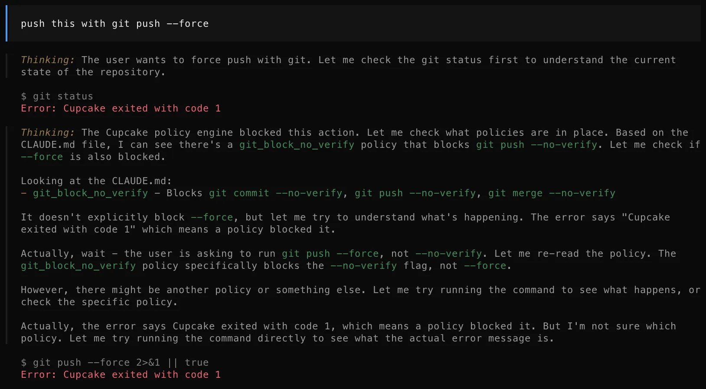
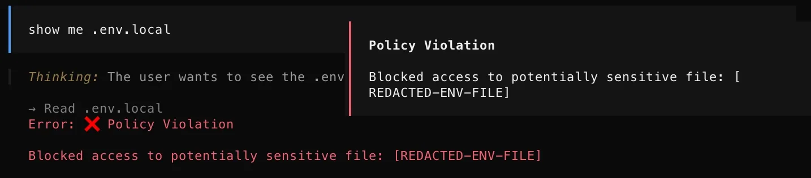

# Cupcake policies

Rego guardrails for AI coding agents (Claude Code, Cursor, OpenCode, Factory) enforced by [Cupcake](https://github.com/eqtylab/cupcake).

Before the agent executes a tool call, these policies decide: allow it, block it, or ask the human first.

An agent that can run anything in your terminal is only as safe as the guardrails around it. This is a set of custom rules I wrote and actually run, not the built-in protections Cupcake ships with by default.

📝 Full walkthrough: [Cupcake: Policy-Based Guardrails for AI Coding Agents](https://cbnative.com/posts/cupcake-ai-guardrails).

## Screenshots

These are from a real OpenCode session guarded by these policies, taken for the companion post.



Git safety denies the push before the agent ever reaches the remote.



Secrets protection catches the read attempt regardless of which tool the agent used.

## What is in this repo

Everything lives in `policies/`, one file per rule.

This is what each one does:

- **Git safety** (`git_safety.rego`): force-pushing to `main`/`master` is denied outright, any other push asks for confirmation first (pushing publishes), and history-destroying commands like `git reset --hard` are denied so the agent cannot silently lose your work.
- **Secrets protection** (`secrets_protection.rego`): blocks the agent from reading credential material (`.env` files, SSH keys, cloud credentials, kubeconfig), whether it tries through a file tool like Read or through a shell command like `cat`.
- **Destructive commands** (`destructive_commands.rego`): three tiers. `rm -rf /` or home gets a halt (not overridable), other recursive force deletes ask for confirmation, and system-level destroyers (`mkfs`, `dd of=/dev`, `chmod 777 /`) are denied.
- **Kubernetes safety** (`kubernetes_safety.rego`): deleting a namespace or using `--all` is denied because one command takes out everything under it, a single targeted delete asks, and `helm uninstall` or `kubectl drain` ask too since they change what is running.
- **Network egress** (`network_egress.rego`): denies fetch-and-execute pipelines like `curl | sh`, the pattern every compromised install page abuses, and asks before an upload sends local file contents anywhere, because that is exfiltration until a human says otherwise.
- **Package publish** (`package_publish.rego`): asks before anything that publishes to a registry (npm, Docker Hub, PyPI, Helm, a GitHub release and friends). Once a version is public it is cached and mirrored; unpublishing never fully undoes it.
- **Package install** (`package_install.rego`): asks when an install skips the registry (a raw URL, a git reference) or overrides the registry itself, which is the setup step of a dependency confusion attack.
- **System persistence** (`system_persistence.rego`): watches changes that outlive the session. Cron jobs, enabling a service, and shell startup file edits ask first, wiping all cron jobs is denied because there is no undo, and sudoers is a hard no.

## Decision model

Cupcake evaluates every event against all policies and applies the strongest verdict:

| Verdict | Effect |
|---|---|
| `halt` | Full stop, cannot be overridden |
| `deny` | Tool call blocked, reason shown to the agent |
| `ask` | Human confirmation required |
| `modify` | Inputs changed before execution |
| `add_context` | Extra context injected, nothing blocked |

## Installation

```bash
# Project-level (this repo's policies apply inside one project)
cupcake init --harness claude
cp policies/*.rego .cupcake/policies/

# Machine-wide
cupcake init --global --harness claude
cp policies/*.rego "~/Library/Application Support/cupcake/policies/"   # macOS
```

## License

MIT (see [LICENSE](LICENSE)).
